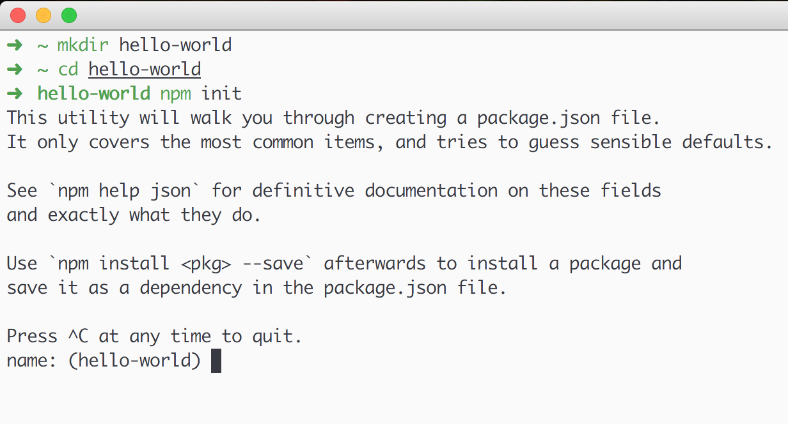
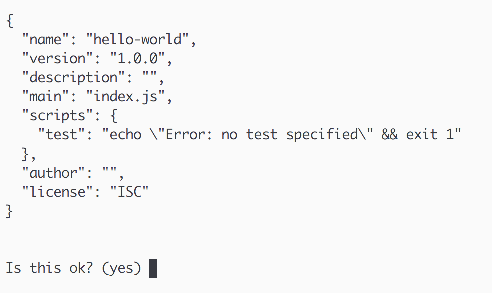
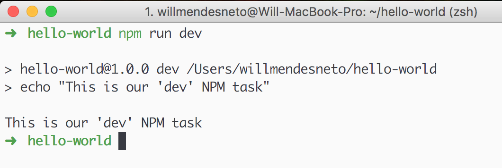
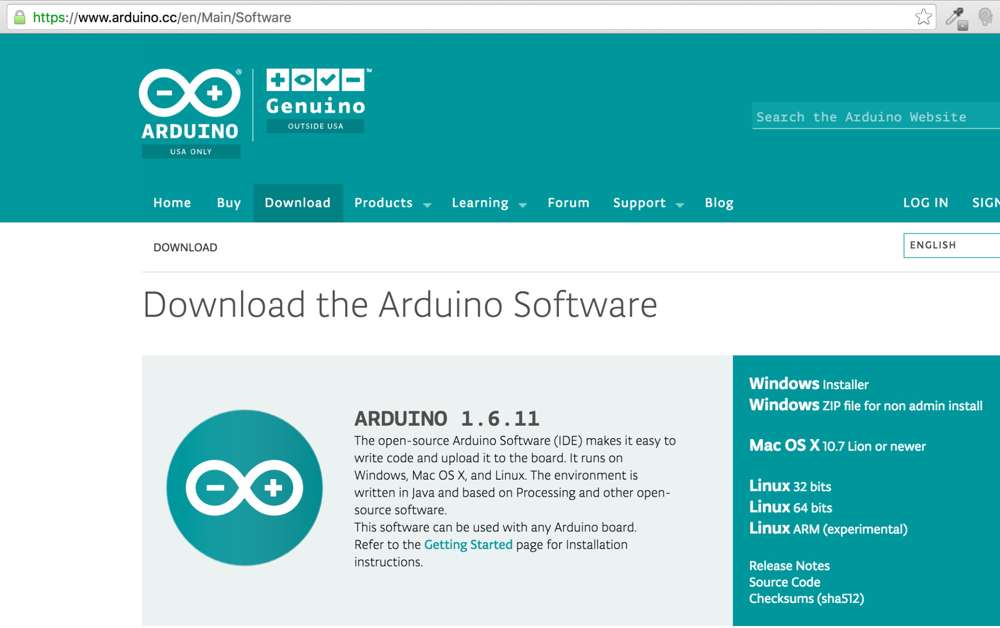
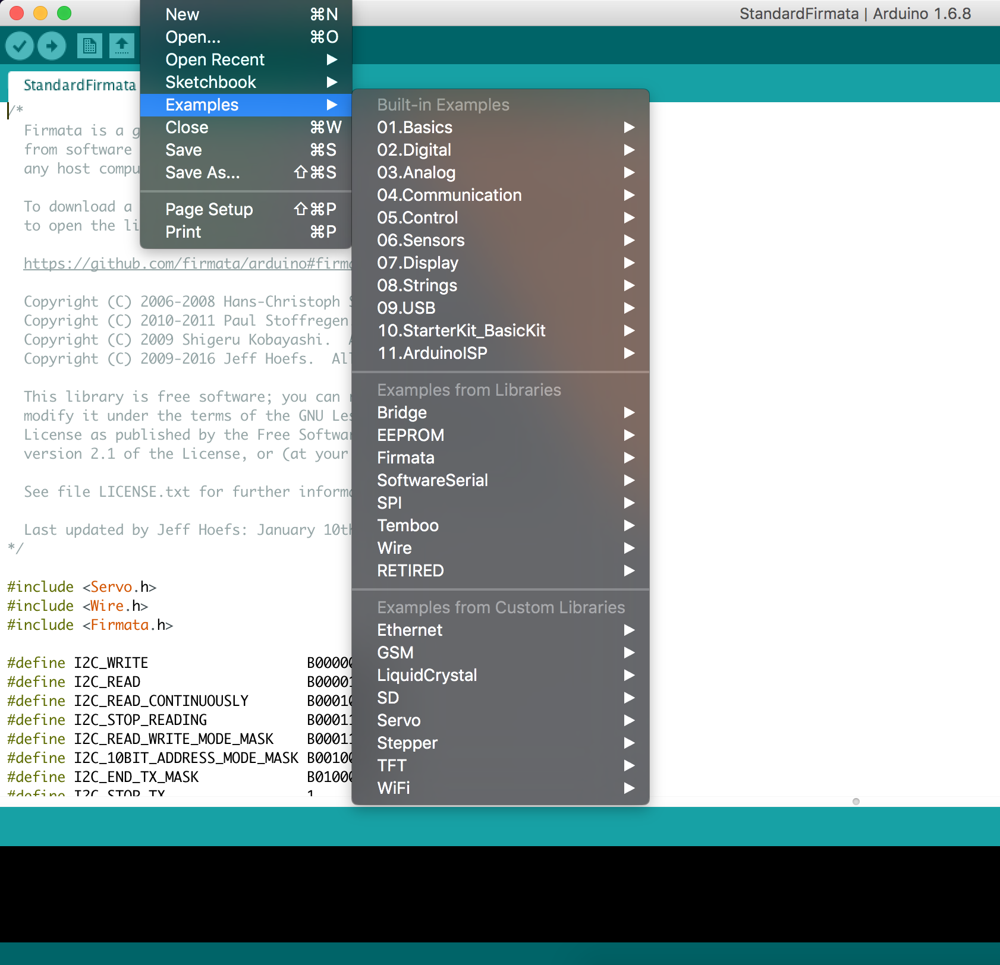
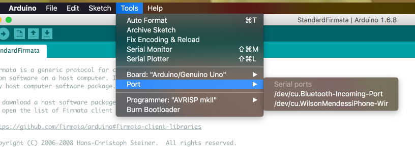
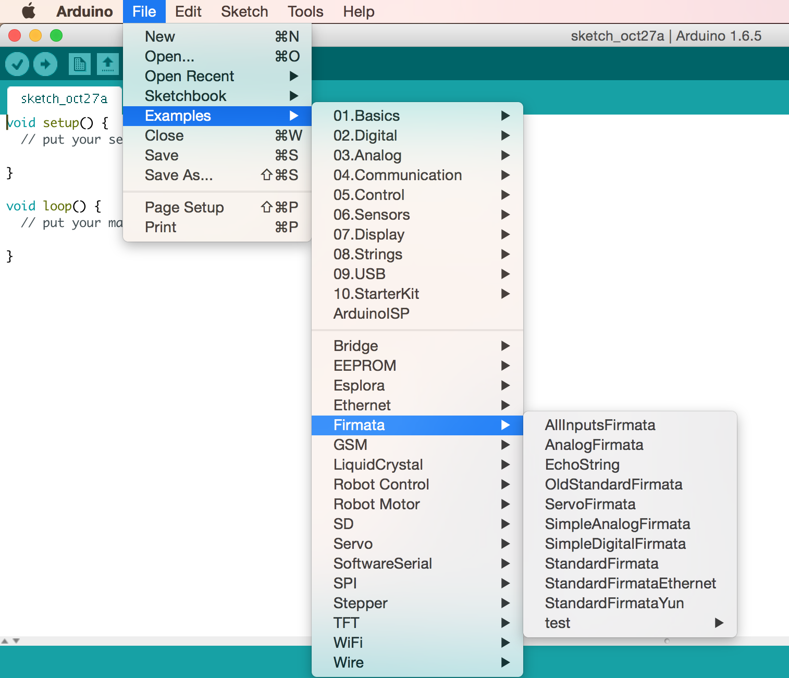

# Nodebots and microcontrollers


## What are nodebots?

NodeBots is a term used to define the concept of control over open hardware, an electronic hardware designed and offered in the same manner and with the same licenses as free code software, sensors and other electronic components using NodeJS. And you can use several elements: from sensors, [servo motors](https://pt.wikipedia.org/wiki/Servomotor), wheels, motion detectors, cameras, LED displays, audio players and more.

In some moments the concept of Nodebots is directly connected to the concept of IoT - Internet of Things. Internet of Things * is a technological revolution in order to connect everyday electronic devices such as home appliances and even industrial machines and devices with internet access and other technical innovations in important fields such as home automation from Sensors.

The whole idea of NodeBots evolved according to increasing capabilities in NodeJS and the effort of some developers like Nikolai Onken, Jörn Zaefferer, Chris Williams, Julian Gautier and Rick Waldron who worked to develop the various modules we use in NodeBots applications nowadays. The [node-serialport](https://www.npmjs.com/package/serialport) module, created by Chris Williams, was the kick-start because it allows access to devices using low-level serial ports.

Julian Gautier then implemented [Firmata](https://www.npmjs.com/package/firmata), a protocol used to access microcontrollers, such as Arduinos, via code using JavaScript for communication between physical components.

Rick Waldron went a little further. Using the Firmata library as a base, he created a framework to assist in building Nodebots and Internet stuff called Johnny-Five.

The Johnny-Five framework makes it easy to control various components, from LEDs to various other types of sensors in a simple and practical way. This is what many NodeBots now use to achieve some awesome feats!


## Microcontrollers

When we talk about nodebots, we are indirectly mentioning microcontrollers. A microcontroller is a smaller and simpler computer that has a simple programmable physical circuit board (we'll call it pins, inputs, etc.) that can detect multiple inputs and outputs.

An Arduino is one of the several types of microcontrollers, being one of the most common for experiments and validations between software and hardware integration. There are other types of microcontrollers too, which can be powered by Node including:

- [Raspberry Pi](https://www.raspberrypi.org/);
- [Tessel](https://tessel.io/);
- [Espruino](http://www.espruino.com/);
- [BeagleBone](http://beagleboard.org/bone);

In this book, I will use [Arduino UNO](https://www.arduino.cc/en/Main/ArduinoBoardUno) in the examples, but feel free to use the microcontroller of your choice.


## NodeJS

NodeJS is a JavaScript execution runtime built on the Javascript engine Javascript V8, enabling the use of Javascript in other environments beyond the web and with an important aspect of non-blocking input model usage and Event-driven data output. It aims to help programmers to create high-scalability applications such as web servers with concurrent connections, asynchronous scripts and even integration with electronic components, that is our case.

It was created by Ryan Dahl in 2009, and its development is maintained by the community and the Node Foundation, of which companies such as IBM, Google, Red Hat, Joyent, among others.


### Installing on Windows

Installing NodeJS on Windows is quite simple. One way is to visit the [official project website](https://nodejs.org/en/download/) and download the installer in the format, click on the installation options and finish the installation. When finished open your command prompt by accessing the Windows command prompt from the "Run> cmd" command and, after starting the program, enter the following command:

```bash
$ node -v
```

It should display at the prompt the current version of NodeJS on your terminal. This completes the installation in the Windows operational system environment.


### Installing on Linux and Mac OS X

For Linux and Mac OS X systems you can use various formats such as downloading the node on the site (as we did on Windows installation), via package manager by operational system, but a way to unify the installation format for UNIX platforms is to use the [NVM - Node Version Manager](https://github.com/creationix/nvm) which is a version manager of NodeJS based on bash script.

It's something very simple to install as well. You can install locally via Curl or Wget, respectively:

```bash
$ curl -o- https://raw.githubusercontent.com/creationix/nvm/v0.35.3/install.sh | bash
```

Wget:

```bash
$ wget -qO- https://raw.githubusercontent.com/creationix/nvm/v0.35.3/install.sh | bash
```

> Packages like CURL and WGET may not be installed on your operating system by default. If necessary, check the best method for your operating system or access the NVM repository on Github to check the installation steps or possible problem solutions.

Next, you should open your file that stores the default configuration of your terminal, which can be located in `~/.bash_profile`,` ~/.zshrc`, `~/.profile` or` ~/.bashrc`, and add these lines at the end of this configuration file so that you will load NVM next time you access the command line.

```bash
export NVM_DIR="$HOME/.nvm"
[ -s "$NVM_DIR/nvm.sh" ] && . "$NVM_DIR/nvm.sh" # This loads nvm
```

With this, as soon as you recharge your terminal the NVM will be available. Now just install the version of NodeJS of your choice. In this book, we will use version 12.16.2.

```bash
$ nvm install 12.16.2
$ nvm use 12.16.2
$ nvm alias default 12.16.2
```

After these commands NVM will download the specific version of NodeJS, making it accessible via the terminal. To verify that the command completed successfully, enter the command:

```bash
$ node -v
```

The result should be `v12.16.2`. If this was the return of your command, you're all set for the next steps. If you have any problems make sure that the NVM loading code has been inserted into the configuration file of your terminal and start another instance of your terminal.

A file with the commands in this topic was created for the installation of NVM and Node with the version used in this book. If you want to use it, please download [nvm-install.sh](https://gist.github.com/willmendesneto/4c951413bacbb8850837a53bcdada30d) file in this gist link.


## Managing dependencies with NPM

### Starting your project and knowing the package.json file

As a first step, let's create the `"hello-world"` folder and add some initial information in the project. For this we will use the command [npm init](https://docs.npmjs.com/cli/init).



To continue you will need to answer some basic questions about the project, such as:
- Package name;
- Project version;
- Description of the project;
- Name of the project's main file. This will be produced at the end of your project, after all minification, obfuscation and other optimisation procedures of your javascript code;


You can rest assured that none of them is mandatory. If you do not know or do not want to respond now, just hit the "Enter" key until the end or run this command with `-y` flag, that means you are answering `yes` for all those questions. It will then create a `package.json` file with this information from your repository.




### Adding Packages

Now that we have our [package.json](https://docs.npmjs.com/files/package.json) with all the basic configurations of our repository, we will install our first package to integrate with our project!

NPM functions are the official package manager for NodeJS applications, being the largest ecosystem of libraries and *open source* modules in the world.

With it you can add packages in your application from the command [npm install](https://docs.npmjs.com/cli/install), informing the name of the package published in the official site of npm and the format that we want to save the Package in the application. We have some options for adding packages, which are:

- locally as a development dependency: the package will be installed locally and accessible in the `node_modules` folder and the package information will be saved in the` devDependencies` key of your JSON file. To use this option add the flag `--save-dev`;
- locally as a dependency of your project: the package will be installed locally and accessible in the node_modules folder and the package information will be saved in the dependencies key of your JSON file. To use this option add the flag `--save`;
- globally: the package will be installed with global scope and accessible in any other project. To use this option add the flag `--global`;

> Packages saved as a development dependency and globally won't be used when you publish your project, so use these options carefully.

For our initial project we will install the Johnny-Five framework as one of the development dependencies by running the command:

```bash
$ npm install --save johnny-five
```


You may notice that we now have some new files in our project folder. Firstly, the folder `node_modules` was created and inside it, we have our package installed successfully.


Another new content information were added in the package in the `dependencies` block of our `package.json` file.

```json
{
  "name": "hello-world",
  "version": "1.0.0",
  "description": "",
  "main": "index.js",
  "scripts": {
    "test": "echo \"Error: no test specified\" && exit 1"
  },
  "author": "",
  "license": "ISC",
  "dependencies": {
    "johnny-five": "^1.4.0"
  }
}
```

> NPM has other standard commands and  we can use them in our application. If you would like to know more about these commands, go to the page about these commands in the [official NPM documentation](https://docs.npmjs.com/misc/scripts).


### Adding NPM Commands

NPM is a very interesting and flexible tool, with the possibility of creating specific commands executed from `npm run your-command`.

In our example, we will create a sample command to run our code. Let's open our `package.json` in our editor/IDE ideally and add the following code:

```json
{
  "name": "hello-world",
  "version": "1.0.0",
  "description": "",
  "main": "index.js",
  "scripts": {
    "dev": "echo \"This is our 'dev' NPM task\"",
    "test": "echo \"Error: no test specified\" && exit 1"
  },
  "author": "",
  "license": "ISC",
  "dependencies": {
    "johnny-five": "^1.4.0"
  }
}
```

Notice that in line 7 we add our new NPM command through the JSON scripts field. Notice that we already had the "test" command which is a standard npm command and it's in the same area as our new command, as this is the default area for adding commands to be executed by NPM.

To run the command, just access the terminal or command prompt and type `npm run dev`. The result will return as follows:




## Arduino

### Arduino ... ardu-WHAT?

Arduino is an open-source platform based on easy-to-use and plug-and-play hardware and integration with sensors from the software. Being a fully malleable and open platform anyone can use it in projects of the most diverse as simple data checks received by light sensors, temperature, humidity, home automation and more.

Some advantages are:

- Cost: the value of an Arduino is very low. Currently, the cost of an [Arduino UNO](https://www.arduino.cc/en/Main/ArduinoBoardUno) is something around $ 50.00 and [Arduino Nano](https://www.arduino. Cc/en/Main/ArduinoBoardNano) costs between $ 15.00 and $ 20.00, being more or less according to the model of your choice;
- Cross-platform: Arduino is compatible with all operating systems and platforms;
- Simple: It does not require of those who will manipulate it a vast knowledge in electronics. Just have a basic notion of development and you can already do things pretty cool;


### About Open source hardware

`Open source hardware` is an electronic hardware with the same culture as free code software. This term is used for the first time to reflect the idea of open and public information about hardware, such as diagrams, product structures and layout data of a printed circuit board.

With the growth of programmable logic devices, the sharing of open logic schemes has also spread. In this case, the hardware specifications are available for everyone, which means you can create or evolve your hardware from that content without any problem.


### Installing Arduino IDE

Installing the Arduino IDE is quite simple. Just go to the [official project website](https://www.arduino.cc/en/Main/Software) and on the main page, we can find all the download options per operating system. Check your operating system and download the installer.



There is [a page on the Arduino Project Wiki with solutions to the most common problems](https://github.com/arduino/Arduino/wiki/Building-Arduino), if you have any kind of inconvenience with the installation and first setup Of the Arduino IDE.


### Initial Arduino Setup

> You can code using your preferred editor or IDE and start this step using the [interchange](https://github.com/johnny-five-io/nodebots-interchange) package. The purpose of the following content is to facilitate the Arduino setup for developers who are having the first contact with the Arduino platform.


After the installation of the Arduino IDE, we will now access the program and verify its operation. Firstly we realize that the Arduino IDE has some examples integrated as a mediator and facilitator for those who have never had contact with the platform. To check the complete list of examples, just access `"File> Examples"`.


Note that in the example codes are written in [C language](https://pt.wikipedia.org/wiki/C_(program language% C3% A7% C3% A3o) and not in Javascript, but nothing prevents you from running the example code based in other programming languages.



Let's now connect our Arduino board into our operating system. Arduino IDE has already stored the configuration of my Arduino, which appears in the item "Board: Arduino Genuino/UNO", but in the first time will appear in the "Port" option, which has the complete listing of serial ports based in your operational system.



The name will appear with the prefix "/dev/cu." and will have the name of the Arduino, facilitating the integration. Choose the port which your Arduino is connected and that's all: the connection was successful.


## Firmata

Firmata is a protocol for communicating with microcontrollers software on a computer (or smartphone/tablet, etc). The protocol can be implemented in the firmware of any microcontroller architecture, such as any computer software package.

Our next step after installing the Arduino IDE is to add the Firmata protocol in our Arduino. Let's open our Arduino IDE and access the `"Files> Examples> Firmware> StandardFirmata"` option.



With the Arduino plugged into your computer you can run the following code and wait for the IDE shows the message that everything happened successfully.


## Johnny Five

Johnny-Five is an open source framework that allows you to control micro-controllers and components using very similar functions that would be used if you were programming only for the Arduino platform itself, but using JavaScript and implementing Firmata protocol for communication with software and computer host.

This allows you to write a custom `firmware` without having to create your own protocol and objects for the programming environment you are using. In summary, Johnny-Five is a node package that allows you to program micro controllers using JavaScript!


### Adding johnny Five to the project

Like any good NodeJS package, adding Johnny-five to the project is a pretty simple task. For this we will use the command that we have already seen, `npm install`, and install johnny five locally, saving as a dependency of project development.

```bash
$ npm install --save johnny-five
```

After this command, NPM will create the folder node_modules and within it, we will have our johnny-five package installed and accessible in the context of our project.

We can also check that our `package.json` has changed. In it were added the information of the name of our NodeJS package and the installed version, as we can see in the code below.

```json
{
  "name": "hello-world",
  "version": "1.0.0",
  "description": "",
  "main": "index.js",
  "scripts": {
    "test": "echo \"Error: no test specified\" && exit 1"
  },
  "author": "",
  "license": "ISC",
  "dependencies": {
    "johnny-five": "^1.4.0"
  }
}
```


### Creating a Hello World

Now that all the setup of our project has been done, let's create our example code, and nothing better than the good old "Hello World", welcoming you to the Nodebots world.

Let's create a simple code. First, we will create the `index.js` file at the root of our project and import the Johnny-five package using the require command.

```javascript
...
const five = require('johnny-five');
...

```

This command makes the request of the package, making it accessible to our project. Now we'll meet our first class Jonny Five: the Board.

The Board class returns to the application an object that represents the physical board itself in the electronics. All device objects depend on this object to be initialized.

```javascript
...
const board = new five.Board();
...
```

The board object has a `.on()` method, which is commonly used in Javascript applications for creating event handlers. This method accepts 2 parameters:

- Name of the event;
- function to be executed when the event is triggered;

In this example, we will call this method with the `ready` option, which verifies when the code is already accessing the physical card used.

```javascript
...
board.on('ready', function() {
  console.log('Hello World!');
});
...
```

And the final content of our `index.js` has been pretty tight, as you can see below.

```javascript
const five = require('johnny-five');
const board = new five.Board();

board.on('ready', function() {
  console.log('Hello World!');
});
```

Now we can run our code via the command line by typing the command:

```javascript
$ node index.js
```

And the result returned will be the message *"Hello World"*, as you can see in the figure below.


If you want to make it easier, we can use npm start, one of the standard NPM commands we can create in our `package.json`, making it accessible via the command line.

```json
{
  "name": "hello-world",
  "version": "1.0.0",
  "description": "",
  "main": "index.js",
  "scripts": {
    "start": "node index.js",
    "dev": "echo \"This is our 'dev' NPM task\"",
    "test": "echo \"Error: no test specified\" && exit 1"
  },
  "author": "",
  "license": "ISC",
  "dependencies": {
    "johnny-five": "^1.4.0"
  }
}
```

After adding the command, just type in the `npm start` command line and the result will be the same message as the previous command.

In this topic, you have seen the integration between our Javascript code and the hardware. In the next chapters, we will see more examples showing in a simple and fun way how to integrate Nodebots into our daily life.
